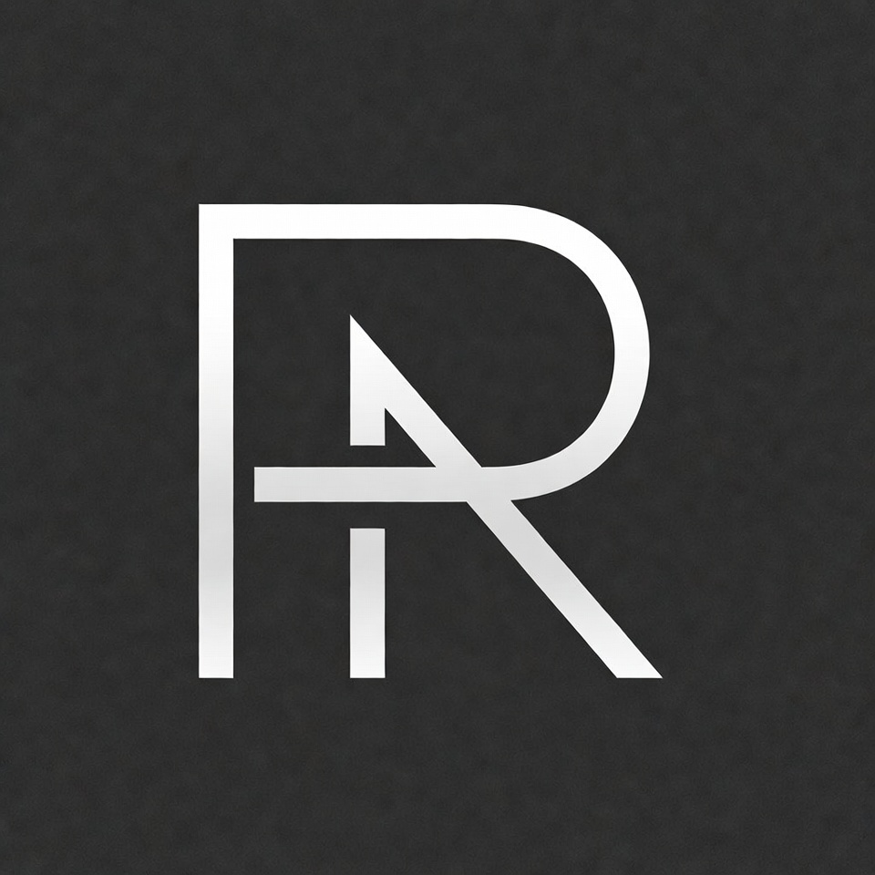

  
<h1>I am Pooria Rezaee! People call me Pori :)   💛👨🏼‍💻</h1>

 

  <h2>My Skills </h2>

<h3>🚀 About Me</h3>
<ul>
  <li> 🔭 I’m currently working on improving my HTML, CSS skills.</li>
  
  <li> 🌱 I’m currently learning . JavaScript . </li>
  
  <li> 💬 Ask me about Frontend basics, I'm happy to help!</li>

  <li> 
     📫 How to reach me:
     .  pooriarezaee.dev@gmail.com  . 
  </li>
</ul>

