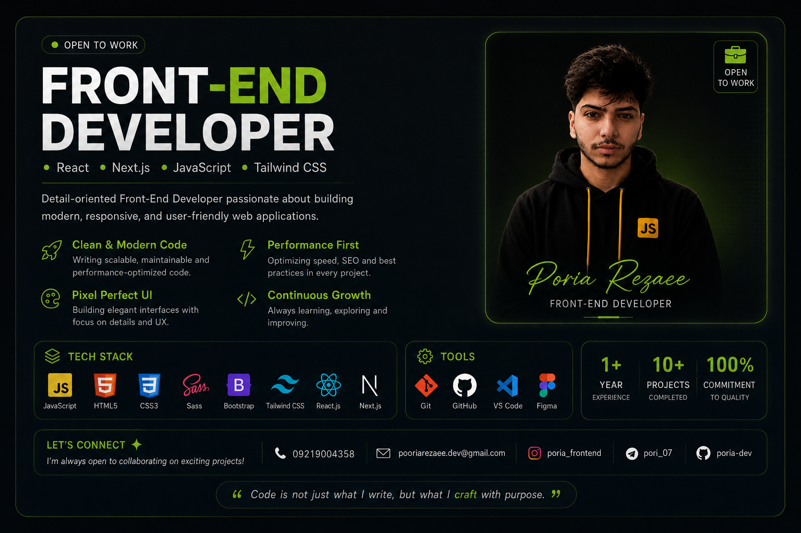

  
  

 

  

----

  

  

 

  <h2>My Skills </h2>

 

<!-- بخش اول: زبان‌ها، فریم‌ورک‌ها و ابزارهای اصلی (۲ ردیف ۷تایی منظم) -->

  

 
<!-- بخش دوم: کتابخونه‌های خاص (انیمیشن و اسلایدر) -->

  
  

 

   

## 👨‍💻 About Me

Hi, I'm **Poria Rezaee** — a passionate Front-End Developer from Iran 🇮🇷.

I enjoy building fast, modern, and responsive web applications with a strong focus on clean code, performance, and user experience.

🚀 Building production-ready React & Next.js applications

🌱 Currently mastering TypeScript and modern frontend architecture

💡 Passionate about clean UI, performance and accessibility

🤝 Open to Front-End, Freelance and Open Source opportunities 

<h2 align="center">
  
  Let's Connect
  
</h2>

  
  &nbsp;&nbsp;&nbsp;&nbsp;

  
  &nbsp;&nbsp;&nbsp;&nbsp;

  
  &nbsp;&nbsp;&nbsp;&nbsp;

  
  &nbsp;&nbsp;&nbsp;&nbsp;

  
  &nbsp;&nbsp;&nbsp;&nbsp;

  

  
 

 

## 📊 GitHub Analytics & Stats

 
  

  
  
  

  

  <h3 style="color: #00aaff; text-shadow: 0 0 20px #00aaff, 0 0 40px #0099ff; letter-spacing: 4px; margin-bottom: 30px; font-family: monospace;">
    NEON PAC-MAN GRID
  </h3>

  <picture>
    <source media="(prefers-color-scheme: dark)" srcset="https://raw.githubusercontent.com/poria-dev/poria-dev/output/pacman-contribution-graph.svg">
    <source media="(prefers-color-scheme: light)" srcset="https://raw.githubusercontent.com/poria-dev/poria-dev/output/pacman-contribution-graph.svg">
    
  </picture>

 

---

# Thanks for Stopping By 👋

### Building modern, responsive, and high-performance web experiences.

 

⚡ **Clean Code** • 🎨 **Pixel Perfect UI** • 🚀 **Performance** • 📱 **Responsive Design** • ♿ **Accessibility**

 

> *"Every line of code should create value, not just functionality."*

 

### ⭐ Like what you see?

If my projects inspire or help you, consider giving them a **⭐** and following me on GitHub.

  

**Thanks for visiting, and let's build something amazing together. 🚀**

---

